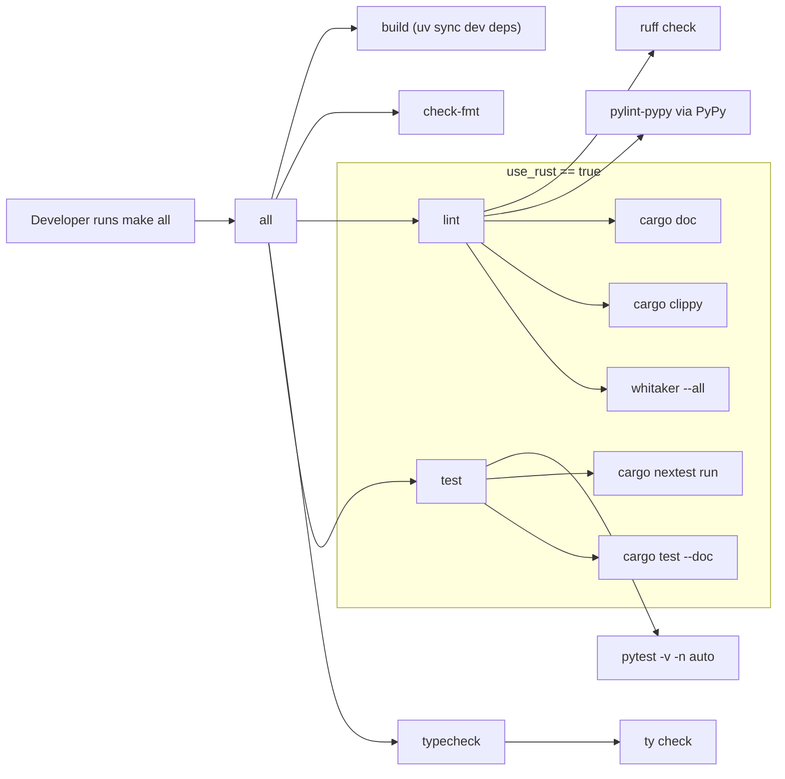

# Generic Copier Template

This repository provides a [Copier](https://copier.readthedocs.io/) template for a Python package.
It offers two flavours:

1. **Python Only** – a pure Python implementation.
2. **Python with Rust** – includes a PyO3 extension.

Run `copier copy` and answer the prompts to generate a project.

## Running Tests

The test suite relies on the `pytest-copier` plugin and renders generated
projects that run Ruff, Pylint via a PyPy-backed runner, `ty`, pytest, and, when
the Rust extension is enabled, Clippy, Whitaker, and nextest-aware Rust tests.

Run the parent template tests through the repository `Makefile`. Run
`make help` to list the available parent Makefile targets. The `test` target
uses `uvx` to provide `pytest-copier`, `PyYAML`, `syrupy`, and `make-parser`
without a manually managed virtual environment:

```bash
make test
```

Generated projects install and run their own tooling, including Ruff, Pylint via
PyPy, `ty`, pytest, and, when Rust is enabled, Clippy, Whitaker, and nextest.

You can also run `scripts/setup_test_deps.sh` to install parent test
dependencies into the current Python environment manually.

## Generated Quality Gate Flow

Figure: The generated `make all` quality gate runs build, formatting, linting,
typechecking, and testing. Rust-specific lint and test branches run only when
the Rust extension is enabled.


